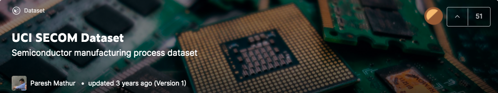
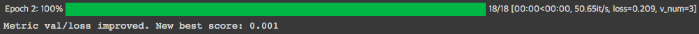

# Anomaly Detection using SEMCONdata


## Introduction
반도체 데이터를 이용한 딥러닝 기반 이상치 탐지 프로젝트입니다. 구글 코렙환경에서 592개 특징을 가진 1592개의 데이터를 이용하여 MLP, 1DCNN 기반의 이진 분류 모델을 만들었습니다.

#### Environment
```shell
google colab
```
#### Data
```
shape: (1567,592)
```

#### Model
```
- Multi layered Perception
- 1 Dementional Convolutional Neural Network

- Batch Normalization
- Dropout
```

#### Training
```
- Optimizer: Adam
- Regularization: Y (weight decay = 1e-5)

- Early Stopping: val/loss, patience= 5
```
tt

## Sample Image

## Experiment


|Date|Architecture|Test acc(%)|Test loss|Comment|    
|------|------|------|------|------|
|2021.09.09|MLP|1.61|82.9|MLP(64-16-1)+adam|
|2021.09.16|1DCNN|99.9|0.001|Dropout,Batch정규화 적용|


-----------------------

## Other Links

You can download [semicon-dataset](https://www.kaggle.com/paresh2047/uci-semcom) in kaggle.
